<p align="center">
  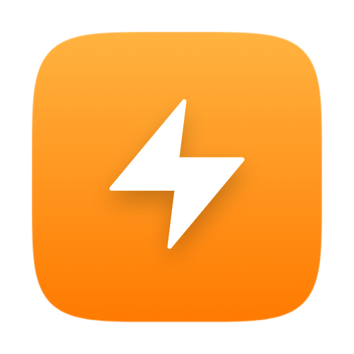
</p>

<h1 align="center">SatyajitOS</h1>

<p align="center">
  <strong>A macOS &amp; iOS inspired portfolio that actually boots.</strong><br />
  <sub>Drag the windows. Read the (very real) inbox. Type <code>sudo rm -rf /</code>. I dare you.</sub>
</p>

<p align="center">
  <a href="https://satyajiit.github.io/SatyajitOS-macOS-Portfolio/"></a>
  <a href="https://youtube.com/shorts/AATMuDmTlTc"></a>
  
  
  
  
  
  <a href="./LICENSE"></a>
  <a href="https://github.com/satyajiit/SatyajitOS-macOS-Portfolio/stargazers"></a>
</p>

<p align="center">
  
  
  
  
  
  
</p>

<p align="center">
  <a href="#-the-boot-sequence">Demo</a> •
  <a href="#-pre-installed-apps">Apps</a> •
  <a href="#-screenshots">Screenshots</a> •
  <a href="#-quick-start">Quick start</a> •
  <a href="#-make-it-yours">Make it yours</a> •
  <a href="#-under-the-hood">Architecture</a> •
  <a href="./DESIGN.md">Design system</a>
</p>

<p align="center">
  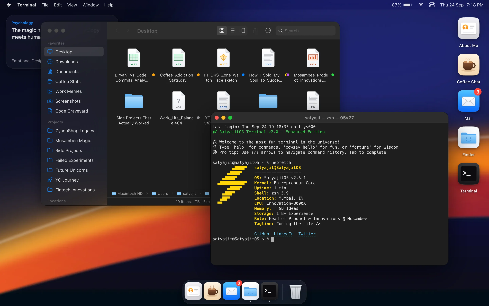
</p>

---

Most portfolios are a hero, three cards and a contact form. This one is an operating system.

On a laptop you get a **Mac**: a menu bar that works, a Dock that magnifies, windows you can drag, resize, zoom and minimise into the Dock, Control Center, notifications, a lock screen and a Terminal with 70-odd commands. On a phone you get an **iPhone**: a home screen with widgets, apps that open out of their icon, swipe-up-to-go-home, Control Centre and Notification Centre.

Both run on one design system, built on Apple's real system colours, light and dark, with all eight macOS accent colours. People kept asking for the source, so here it is. 🍿

## 📼 The boot sequence

<table>
  <tr>
    <td width="68%">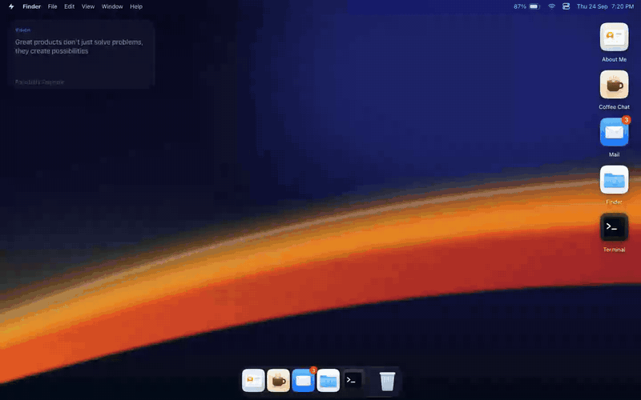</td>
    <td width="32%" align="center">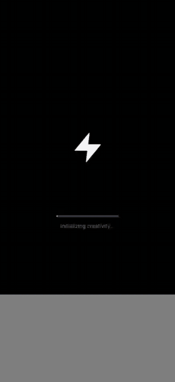</td>
  </tr>
  <tr>
    <td align="center"><sub><b>The Mac</b>: Dock magnification, window dragging, <code>neofetch</code>, minimise-to-Dock · <a href="./docs/media/clip-desktop.mp4">mp4</a></sub></td>
    <td align="center"><sub><b>The iPhone</b>: open, swipe home, Control Centre · <a href="./docs/media/clip-phone.mp4">mp4</a></sub></td>
  </tr>
  <tr>
    <td>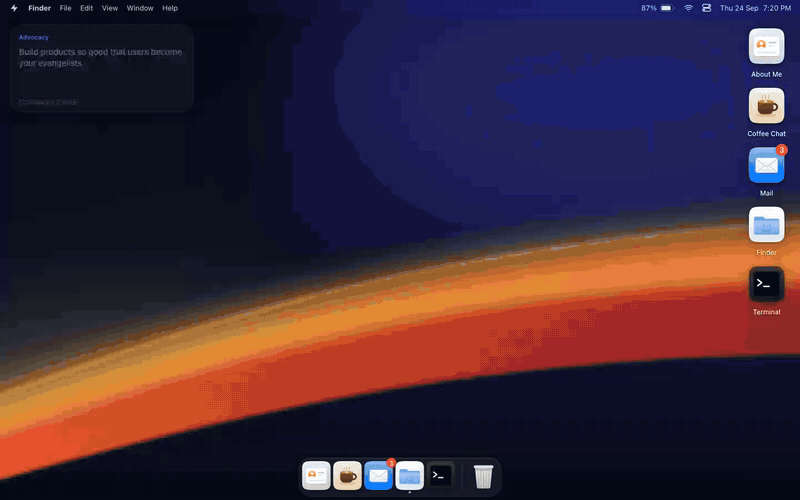</td>
    <td align="center">
      <a href="https://youtube.com/shorts/AATMuDmTlTc">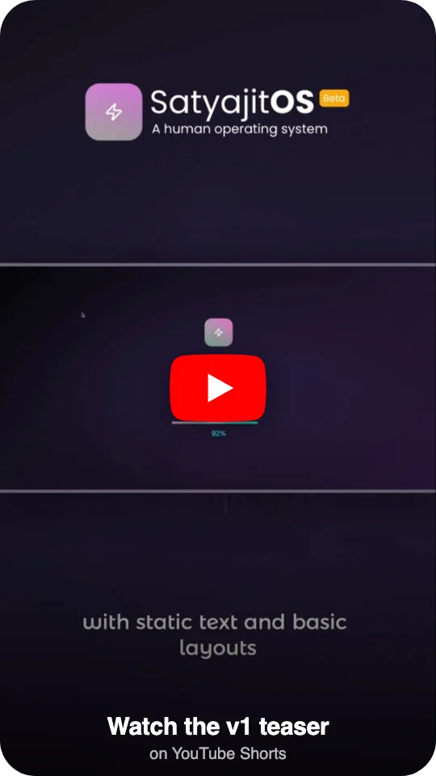</a>
    </td>
  </tr>
  <tr>
    <td align="center"><sub><b>Accent colours &amp; dark mode</b>, live from Control Center · <a href="./docs/media/clip-appearance.mp4">mp4</a></sub></td>
    <td align="center"><sub>The <b>v1 teaser</b> that started it all</sub></td>
  </tr>
</table>

<p align="center">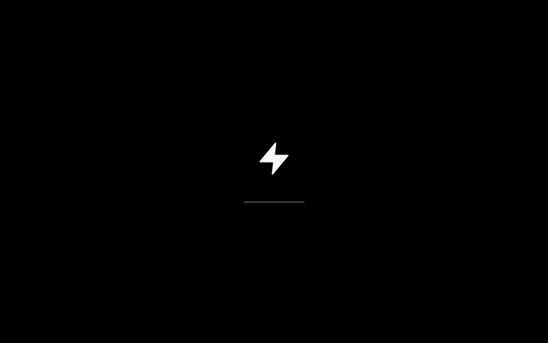</p>
<p align="center"><sub>Yes, it boots. No, you can't skip it. (You can. Click anywhere.)</sub></p>

## 💻 System requirements

| Component | Minimum | Recommended |
| :-- | :-- | :-- |
| **Browser** | Anything that shipped `backdrop-filter` | A recent Safari, Chrome, Firefox or Edge |
| **RAM** | 1 tab | 1 tab and no guilt about the other 47 |
| **Display** | 320px wide (you get the iPhone) | 1280px and up (you get the Mac) |
| **Input** | A finger | A trackpad, for Dock-magnification ASMR |
| **Caffeine** | Optional | Strongly advised. The OS runs on it. |
| **Sense of humour** | Required | Required |

## 📦 Pre-installed apps

| | App | On the Mac | On the iPhone |
| :-: | :-- | :-- | :-- |
|  | **About Me** | An *About This Mac* for a human: spec sheet, uptime, achievements | iOS profile page |
|  | **Coffee Chat** | Book a virtual coffee. It brews first. | Grouped iOS form with a big button |
|  | **Mail** | Three-pane Mail with flags, junk, trash, undo and compose | Mailboxes → Inbox → message, swipe actions |
| 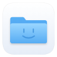 | **Finder** | Icon, list and gallery views, Quick Look (Space), Get Info (⌘I), tags | *Files*, with edge-swipe back |
| 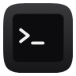 | **Terminal** | zsh-flavoured shell with pipes, `&&`, history and Tab completion | *Termux*, with an extra-keys row |
| 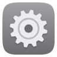 | **Settings** | *(Control Center does this on the Mac)* | Appearance, accent colour, Wi-Fi, updates, install |

Plus the system around them: the menu bar (with working menus), Control Center, Notification Center, the Dock, desktop widgets, a lock screen, sleep, restart and shut down. Shut down is a lie. It's a website.

## 🥚 Things to try

<details>
<summary><b>Spoilers ahead. Open at your own risk.</b></summary>

<br />

- In Terminal: `neofetch`, `sudo rm -rf /`, `hack`, `matrix`, `cowsay ship it`, `fortune`, `coffee`, `sl`, `42`, `rickroll`. Also pipe things: `cat ~/Desktop/secret_project.md | grep Progress`.
- **Shut Down…** from the bolt menu. It will try its best.
- Lock the screen (bolt menu → Lock Screen). The hint is not subtle.
- Click the Trash in the Dock. It has feelings.
- In Finder, open `Work_Life_Balance.404`. Then press **Blame Someone**.
- Right-click any file in Finder. Choose violence ("Blame the Intern").
- Open Mail's Junk folder. A prince would like a word.
- On the phone, scroll down in Control Centre. Satyajit's Controls include a procrastination blocker, and it works about as well as you'd expect.

</details>

## 📸 Screenshots

<table>
  <tr>
    <td width="50%">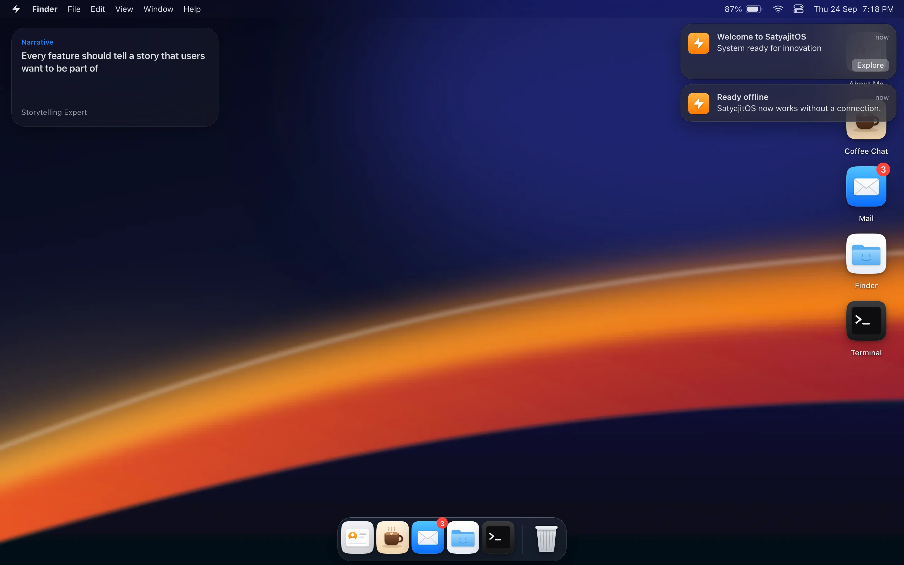</td>
    <td width="50%">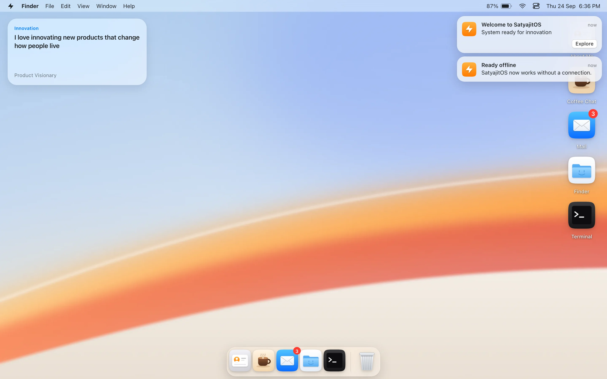</td>
  </tr>
  <tr>
    <td align="center"><sub><b>Dark</b>, the default</sub></td>
    <td align="center"><sub><b>Light</b>, for the brave</sub></td>
  </tr>
  <tr>
    <td>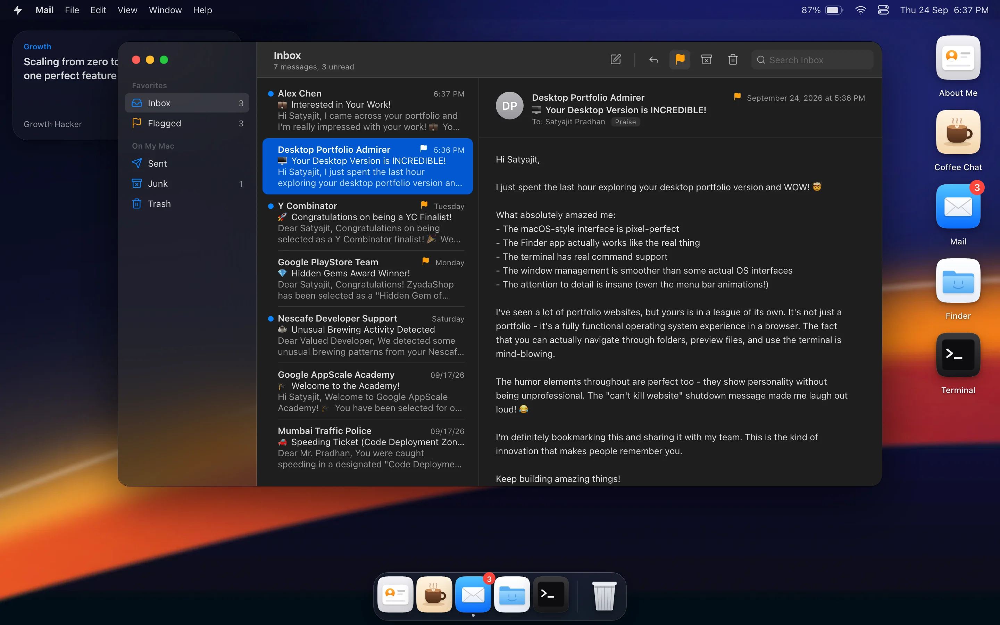</td>
    <td>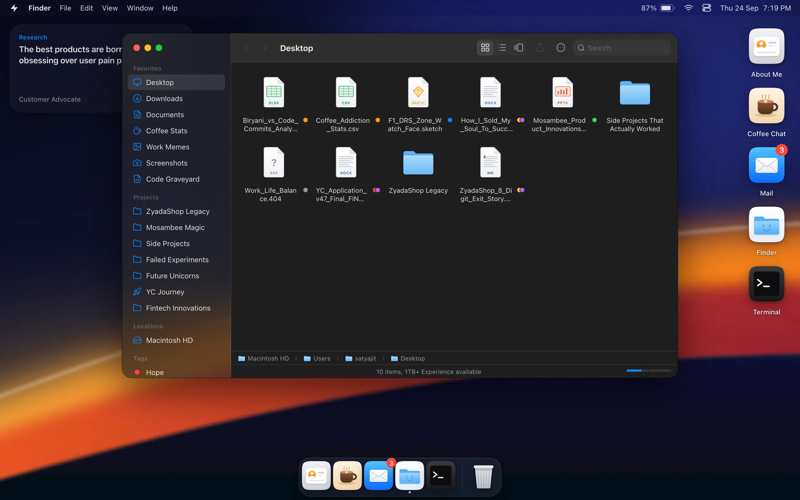</td>
  </tr>
  <tr>
    <td align="center"><sub><b>Mail</b>: vibrant sidebar, real selection states</sub></td>
    <td align="center"><sub><b>Finder</b>: tags, path bar, "1TB+ Experience available"</sub></td>
  </tr>
  <tr>
    <td>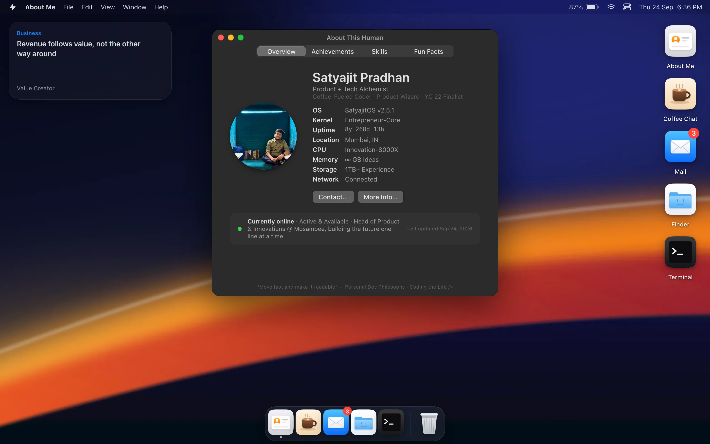</td>
    <td>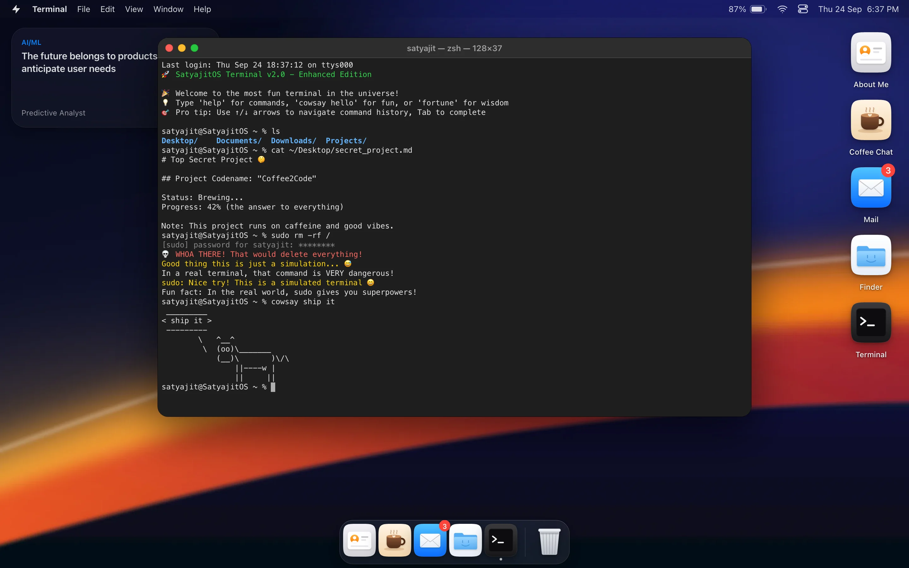</td>
  </tr>
  <tr>
    <td align="center"><sub><b>About This Human</b></sub></td>
    <td align="center"><sub><b>Terminal</b>: please don't actually run that</sub></td>
  </tr>
  <tr>
    <td>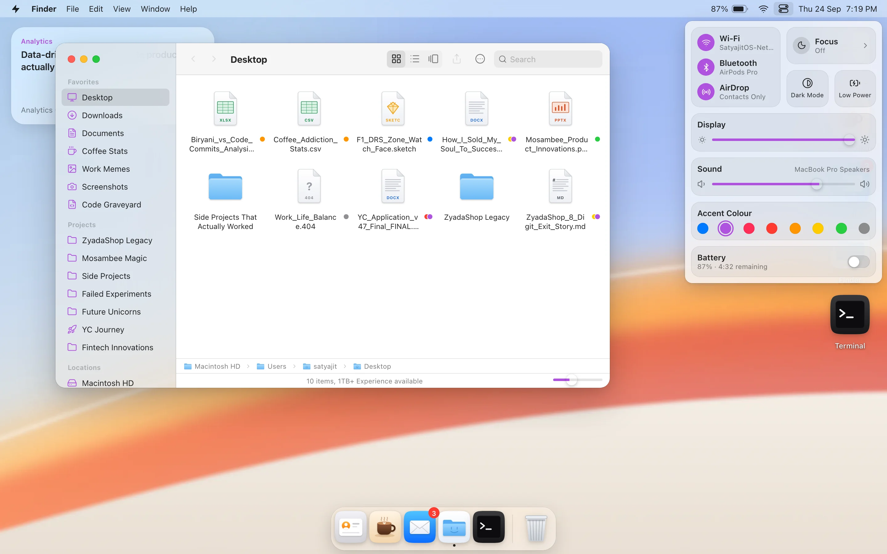</td>
    <td>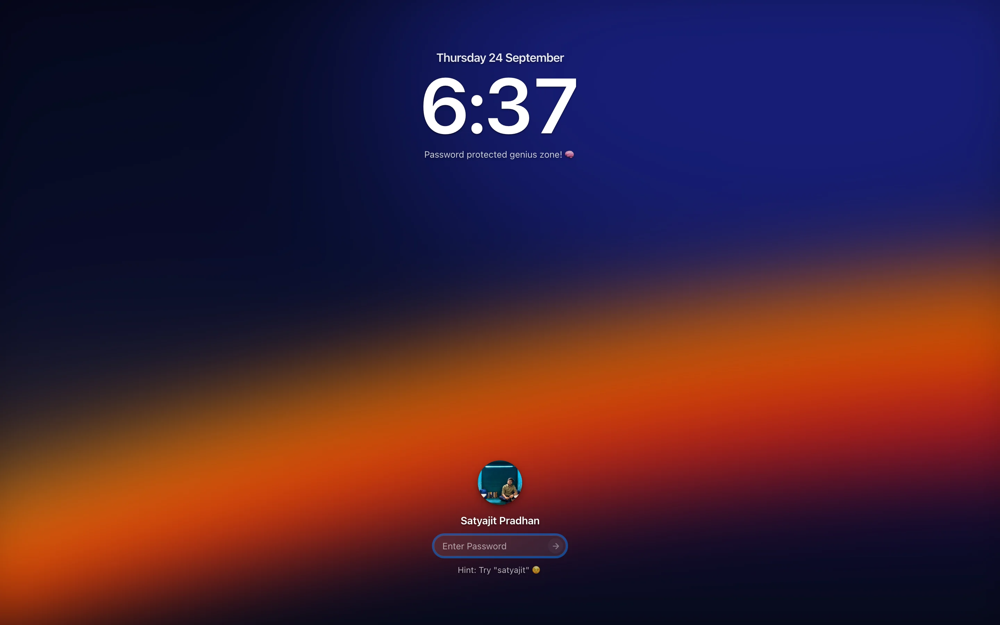</td>
  </tr>
  <tr>
    <td align="center"><sub><b>Control Center</b>: eight accents, live re-theming</sub></td>
    <td align="center"><sub><b>Lock screen</b>: shakes on a wrong password, like the real one</sub></td>
  </tr>
</table>

<table>
  <tr>
    <td>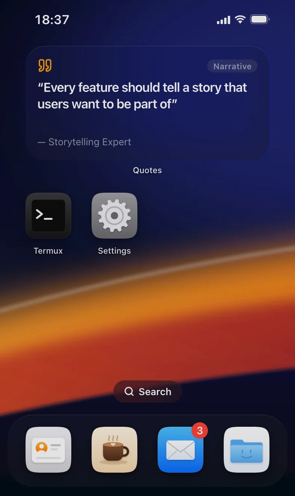</td>
    <td>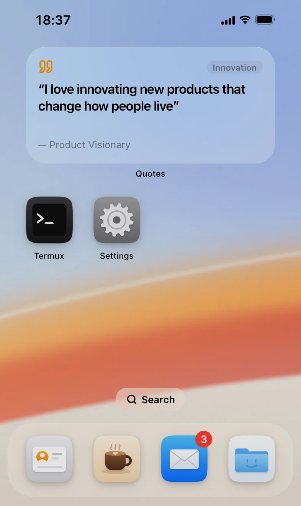</td>
    <td>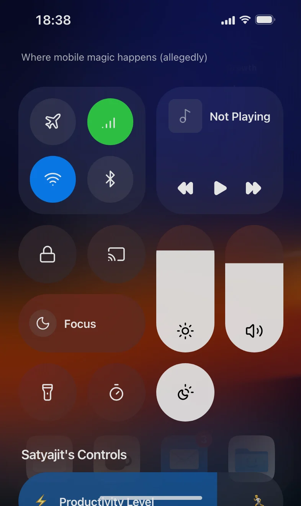</td>
    <td>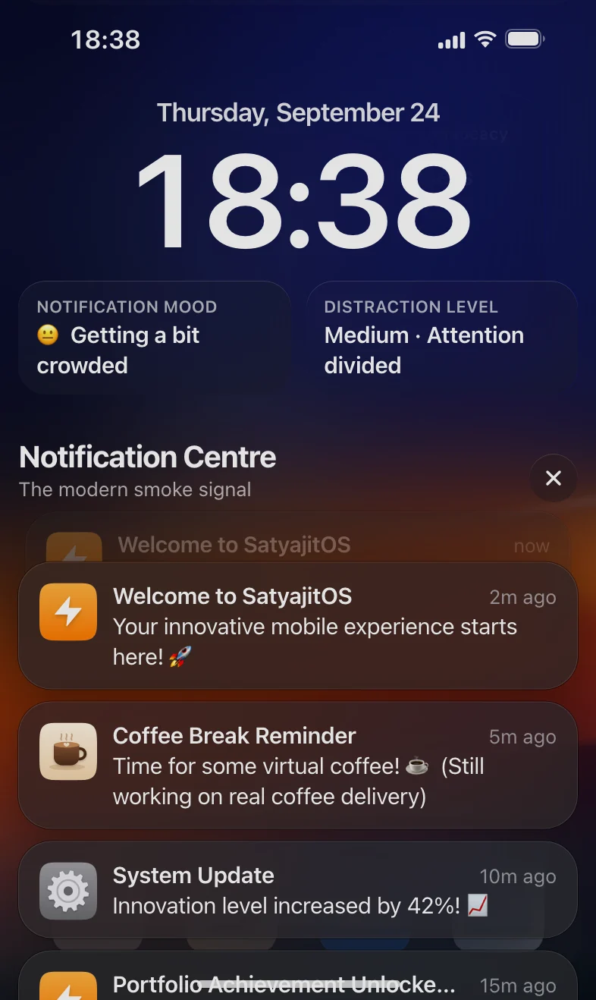</td>
  </tr>
  <tr>
    <td>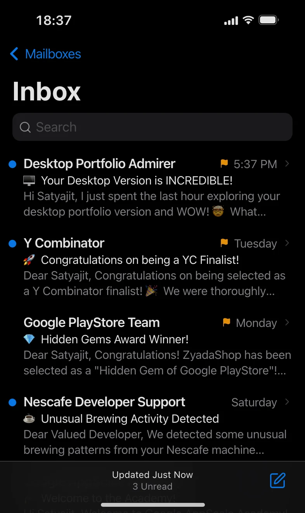</td>
    <td>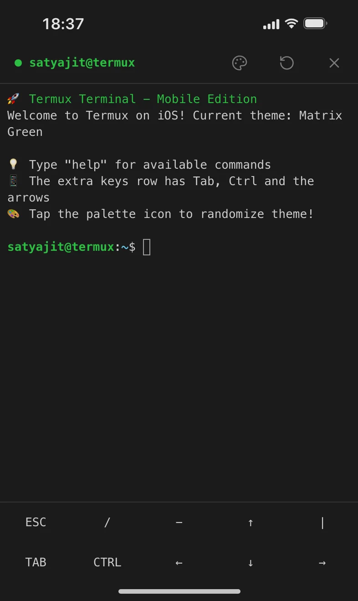</td>
    <td>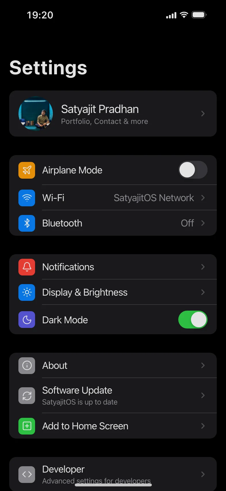</td>
    <td>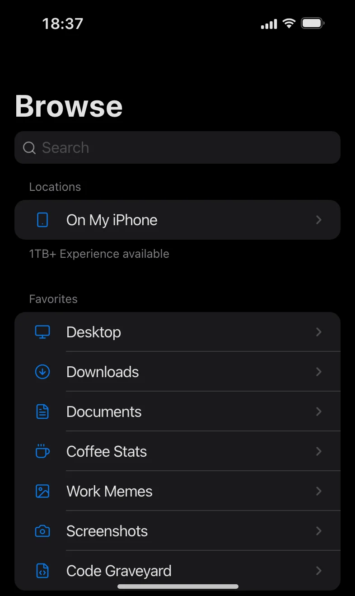</td>
  </tr>
</table>

<p align="center"><sub>Every screen ships in both appearances. The phone follows the same tokens as the Mac, with iOS semantics layered on top.</sub></p>

## 🚀 Quick start

```bash
git clone https://github.com/satyajiit/SatyajitOS-macOS-Portfolio.git
cd SatyajitOS-macOS-Portfolio
npm install
npm run dev          # http://localhost:5173
```

Add `?shell=mobile` to any URL to get the iPhone on a laptop, or `?shell=desktop` to get the Mac on a tablet. Add `?boot=skip` if you've seen the boot screen enough times today.

| Script | What it does |
| :-- | :-- |
| `npm run dev` | Dev server with hot reload |
| `npm run build` | Type-check and build to `dist/` (with the service worker) |
| `npm run preview` | Serve the production build on `:4173` |
| `npm test` | Unit tests: window manager, stores, Mail, Finder and the Terminal engine |
| `npm run lint` / `npm run type-check` | ESLint and `vue-tsc` |
| `npm run check` | All of the above, the way CI runs it |
| `npm run media` | Re-shoot every screenshot and GIF in this README ([how](./docs/CUSTOMIZE.md#8-refresh-the-screenshots)) |

Needs Node 22.12 or newer.

## 🎨 Make it yours

Everything about me lives in [`src/content`](./src/content): my name, photo, bio, the emails, the Finder files, the Terminal jokes. Components only render that data. So forking this into *YourNameOS* is mostly editing TypeScript objects:

1. **Rename the OS** in `src/content/site.ts`.
2. **Introduce yourself** in `src/content/profile.ts` and swap the photo.
3. **Rewrite the apps' content**: `about.ts`, `mail.ts`, `files.ts`, `terminal.ts`, `coffee.ts`.
4. **Add an app**: one entry in `src/apps/registry.ts`, plus an icon and two components. The Dock, menu bar, home screen and routing pick it up.
5. **Push to `main`.** The included workflow deploys to GitHub Pages.

The full walkthrough is in [**docs/CUSTOMIZE.md**](./docs/CUSTOMIZE.md). Code is MIT; please swap my face for yours before you ship. 🙏

## 🧠 Under the hood

```
src/
├── design/        # the token system: Apple colours, materials, type, motion
├── ui/            # shared macOS/iOS primitives + window chrome + app icons (SVG)
├── apps/          # one folder per app, each with a Desktop and a Mobile view
│   └── registry.ts     # the only list of apps: Dock order, window sizes, icons
├── shells/
│   ├── desktop/   # menu bar, Dock, windows, Control Center, lock screen…
│   └── mobile/    # status bar, home screen, gestures, Control Centre…
├── stores/        # Pinia: windows, appearance, notifications, system state
├── content/       # every word and photo about the owner (edit this to fork)
└── app/           # router + service-worker wiring
```

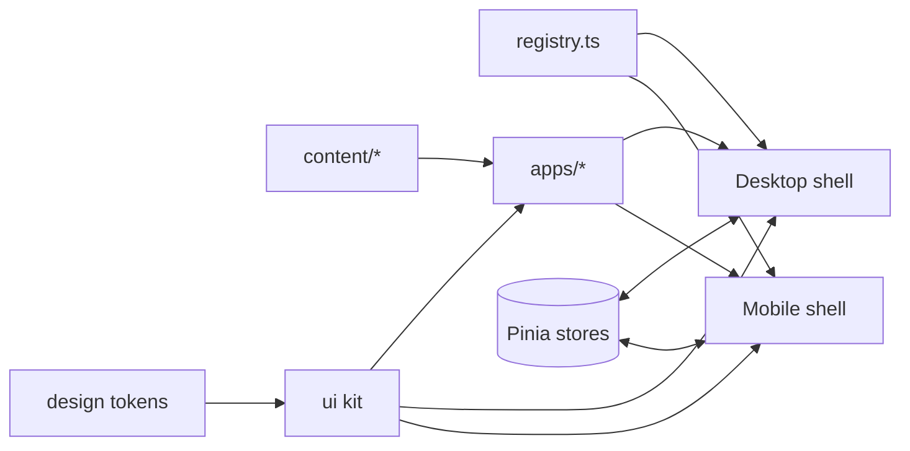
```mermaid
flowchart LR
  R[registry.ts] --> D[Desktop shell]
  R --> M[Mobile shell]
  C[content/*] --> A[apps/*]
  A --> D
  A --> M
  T[design tokens] --> U[ui kit]
  U --> A
  U --> D
  U --> M
  S[(Pinia stores)] <--> D
  S <--> M
```

- **One registry, two shells.** Apps don't know which OS they're in. The Mac shell mounts each app in a draggable window; the iPhone shell mounts it full-screen and grows it out of its icon. A phone-sized viewport gets the iPhone, everything else the Mac.
- **One URL scheme.** `/app/terminal`, `/app/email/<id>` and `/finder/<folder>/<file>` deep-link into the same app on both shells, and the tab title follows the frontmost app.
- **A real design system.** Tailwind's default palette is deleted. Colours, radii, shadows and type sizes come only from tokens that mirror AppKit and UIKit (`--label`, `--fill`, `--separator`, `--selection`…), and frosted-glass materials recreate vibrancy. Details in [**DESIGN.md**](./DESIGN.md).
- **Physics, not keyframes.** Anything you can touch runs on critically damped springs. Swipes carry their velocity into the release, edges rubber-band, and `prefers-reduced-motion` and `prefers-reduced-transparency` are respected.
- **The Terminal is a real (tiny) shell.** A framework-free engine with a parser (quotes, pipes, `&&`), a virtual file system, history and Tab completion, all unit-tested.
- **Offline-first PWA.** Install it from the bolt menu or Settings. After that it opens like an app, works offline, and tells you when an update is ready.
- **Analytics are optional and off.** Set the `VITE_FIREBASE_*` variables to turn Firebase Analytics on. Leave them unset and the SDK never ships.

### Built with

<p>
  <a href="https://vuejs.org"></a>&nbsp;&nbsp;
  <a href="https://vite.dev"></a>&nbsp;&nbsp;
  <a href="https://www.typescriptlang.org"></a>&nbsp;&nbsp;
  <a href="https://tailwindcss.com"></a>&nbsp;&nbsp;
  <a href="https://pinia.vuejs.org"></a>&nbsp;&nbsp;
  <a href="https://vitest.dev"></a>&nbsp;&nbsp;
  <a href="https://playwright.dev"></a>
</p>

[Vue 3](https://vuejs.org) · [Vite 8](https://vite.dev) · [Pinia](https://pinia.vuejs.org) · [Vue Router](https://router.vuejs.org) · [Tailwind CSS 4](https://tailwindcss.com) · [motion-v](https://motion.dev/docs/vue) · [Lucide](https://lucide.dev) (standing in for SF Symbols, and for every emoji: copy writes `:rocket:` and gets a real icon) · [svgl](https://svgl.app) via [svgl-vue](https://github.com/selemondev/svgl-vue) (brand logos) · [Inter](https://rsms.me/inter/) (standing in for SF Pro off Apple devices) · [vite-plugin-pwa](https://vite-pwa-org.netlify.app) · [Vitest](https://vitest.dev) · [Playwright](https://playwright.dev) (for the README media)

## 🩺 Kernel panics (FAQ)

**Why does ⌘W close my browser tab instead of the window?**
Because your browser claims ⌘W, ⌘N and friends before any web page sees them. Use the menu bar, or install the PWA, where more shortcuts get through.

**Can I actually shut it down?**
You can try.

**Why does the Mac show up on my iPad?**
Tablets in landscape get the Mac, like iPadOS with a keyboard. Rotate to portrait for the iPhone, or add `?shell=mobile`.

**Is this affiliated with Apple?**
No. SatyajitOS is a fan-made homage. The icons, wallpapers and components are original work drawn to Apple's published design guidelines. macOS, iOS, Finder and Mail are trademarks of Apple Inc.

**The GIFs look crunchy.**
GIFs are like that. Every clip has an `mp4` next to it in [`docs/media`](./docs/media).

## 🤝 Contributing

Found a bug? Missing your favourite macOS detail? Issues and PRs are welcome. Run `npm run check` before you push, and keep the tokens locked: if you need a colour that doesn't exist, add a token.

## 📜 License

Code: [MIT](./LICENSE). Content in `src/content` (my bio, photo and emails): please don't. Make your own; that's the fun part.

<p align="center">
  <sub>Built in Mumbai with ☕ by <a href="https://github.com/satyajiit">Satyajit Pradhan</a>. If it made you smile, a ⭐ makes my day.</sub>
</p>
